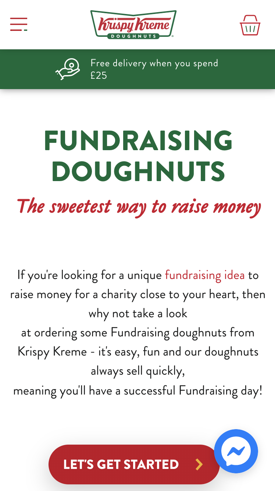

# Procesverslag
Markdown is een simpele manier om HTML te schrijven.  
Markdown cheat cheet: [Hulp bij het schrijven van Markdown](https://github.com/adam-p/markdown-here/wiki/Markdown-Cheatsheet).

Nb. De standaardstructuur en de spartaanse opmaak van de README.md zijn helemaal prima. Het gaat om de inhoud van je procesverslag. Besteedt de tijd voor pracht en praal aan je website.

Nb. Door *open* toe te voegen aan een *details* element kun je deze standaard open zetten. Fijn om dat steeds voor de relevante stuk(ken) te doen.

## Jij

<!-- 
uitwerken voor kick-off werkgroep
 -->

### Auteur:
Jay Raghoebir

#### Je startniveau:
Rood

#### Je focus:
Responsive
 

## Je website

<!-- 
uitwerken voor kick-off werkgroep
 -->

### Je opdracht:
https://www.krispykreme.co.uk/

#### Screenshot(s) van de eerste pagina (small screen): 
 
Landings pagina Krispy Kreme website
 

#### Screenshot(s) van de tweede pagina (small screen):
 
Fundraising pagina Krispy Kreme website
 

 

## Breakdownschets (week 1)

<!-- 
uitwerken na afloop 2e werkgroep
 -->

### De hele pagina: 

### Dynamisch deel (menu): 

### wellicht nog een dynamisch deel (bijv filter): 

## Voortgang 1 (week 2)

<!-- 
uitwerken voor 1e voortgang
 -->

### Stand van zaken
hier dit ging goed & dit was lastig (neem ook screenshots op van delen van je website en code)
Content verzamelen ging heel makkelijk! (dankzij Robert natuurlijk ;)) Ik heb alle content verzameld en de breakdown schets helpt me heel erg met het plaatsen van mijn content in het HTML bestand. Ik heb ook al een deel gestyled (ik ben erg perfectionistisch). Ik heb de echte website ernaast staan en vergelijk het vaak om te kijken of ik het goed doe. Tot nu toe is alles nog wel gelukt, alleen het centreren van tekst in de button/ link was wel lastig. Ik heb Bo om hulp gevraagd erbij en het is nu wel gelukt.
 

 

### Agenda voor meeting
samen met je groepje opstellen

| student 1      | student 2          | student 3    | student 4        |
| ---            | ---                | ---          | ---              |
| dit bespreken  | en dit             | en ik dit    | en dan ik dat    |
| en dat ook nog | dit als er tijd is | nog een punt | dit wil ik zeker |
| ...            | ...                | ...          | ...              |

### Verslag van meeting
hier na afloop snel de uitkomsten van de meeting vastleggen

- punt 1
- punt 2
- nog een punt
- ...

## Voortgang 2 (week 3)

uitwerken voor 2e voortgang

### Stand van zaken
hier dit ging goed & dit was lastig (neem ook screenshots op van delen van je website en code)

### Agenda voor meeting
samen met je groepje opstellen

| student 1      | student 2          | student 3    | student 4        |
| ---            | ---                | ---          | ---              |
| dit bespreken  | en dit             | en ik dit    | en dan ik dat    |
| en dat ook nog | dit als er tijd is | nog een punt | dit wil ik zeker |
| ...            | ...                | ...          | ...              |

### Verslag van meeting
hier na afloop snel de uitkomsten van de meeting vastleggen

- punt 1
- punt 2
- nog een punt
- ...

## Toegankelijkheidstest (week 4)

uitwerken na test in 8e voortgang

### Bevindingen
Lijst met je bevindingen die in de test naar voren kwamen:

#### Titel eerste bevinding
Hier korte omschrijving (met indien nodig een afbeelding)

Hier een omschrijving van hoe het opgelost kan worden (met indien nodig een afbeelding)

#### Titel tweede bevinding. 
Hier korte omschrijving (met indien nodig een afbeelding)

Hier een omschrijving van hoe het opgelost kan worden (met indien nodig een afbeelding)

#### Titel volgende bevinding. 
Hier korte omschrijving (met indien nodig een afbeelding)

Hier een omschrijving van hoe het opgelost kan worden (met indien nodig een afbeelding)

#### Titel nog een bevinding. 
Hier korte omschrijving (met indien nodig een afbeelding)

Hier een omschrijving van hoe het opgelost kan worden (met indien nodig een afbeelding)

## Voortgang 3 (week 4)

uitwerken voor 3e voortgang

### Stand van zaken
hier dit ging goed & dit was lastig (neem ook screenshots op van delen van je website en code)

### Agenda voor meeting
samen met je groepje opstellen

| student 1      | student 2          | student 3    | student 4        |
| ---            | ---                | ---          | ---              |
| dit bespreken  | en dit             | en ik dit    | en dan ik dat    |
| en dat ook nog | dit als er tijd is | nog een punt | dit wil ik zeker |
| ...            | ...                | ...          | ...              |

### Verslag van meeting
hier na afloop snel de uitkomsten van de meeting vastleggen

- punt 1
- punt 2
- nog een punt
- ...

## Eindgesprek (week 5)

uitwerken voor eindgesprek

### Stand van zaken
hier dit ging goed & dit was lastig (neem ook screenshots op van delen van je website en code)

### Screenshot(s)

hier screenshot(s) van je eindresultaat

## Bronnenlijst

<!-- 
continu bijhouden terwijl je werkt
 -->

Nb. Wees specifiek ('css-tricks' als bron is bijv. niet specifiek genoeg).

1. https://www.w3schools.com/howto/howto_css_image_center.asp 
2. https://stackoverflow.com/questions/2703601/how-to-line-break-from-css-without-using-br
3. https://extract.pics/

